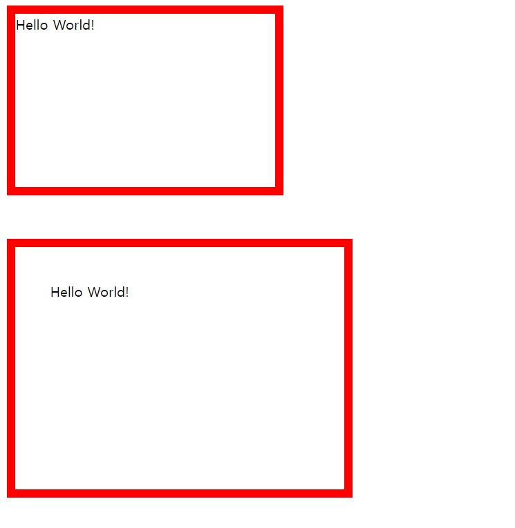
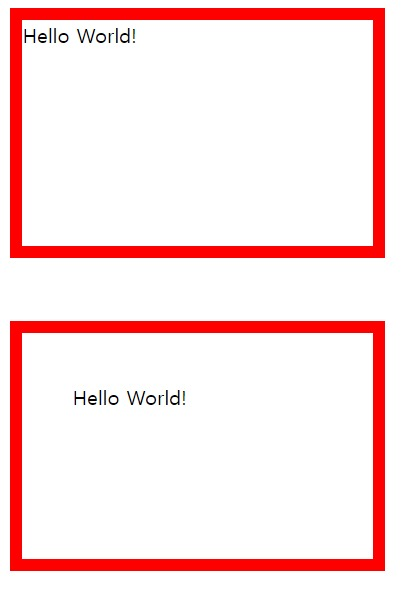

# box-sizing 정리
(여기서 html코드는 모두 다 같다는 것을 참고하자.)
* html
```html
<div class="div1">Hello World!</div>
<div class="div2">Hello World!</div>
```
* css
```css
.div1 {
  border: 10px solid red;
  width: 300px;
  height: 200px;
  margin-bottom: 50px;
}

.div2 {
  border: 10px solid red;
  width: 300px;
  height: 200px;
  padding: 40px;
}
```


```.div1```과 ```.div2```의 ```width```와 ```height```를 똑같이 설정해줬는데, 결과물을 보면 크기가 서로 다르다는 것을 알 수 있다. 그 이유는 ```width```와 ```height```가 테두리(border)와 패딩(padding)을 뺀 *내용물(content)의 크기만* 나타내기 때문이다.   
 

따라서 ```.div1```의 실제 가로 길이는 테두리까지 포함한 320px, 세로 길이는 테두리까지 포함한 220px인 것이다. 반면, ```.div2```의 실제 가로 길이는 테두리와 패딩까지 포함한 400px, 세로 길이는 300px이다.   

실제 가로, 세로 크기가 300px, 200px이기 위해서는 테두리와 패딩을 고려해서 계산을 해줘야 한다는 불편함이 있다.   

## **해결책 : box-sizing**
위 문제를 해결하기 위해서, CSS3부터는 ```box-sizing``` 속성을 사용하면 이 문제를 해결할 수 있다. 따로 설정해주지 않으면 ```box-sizing```의 기본값은 ```content-box```인데, 이걸 ```border-box```로 바꿔보면, 
* css
```css
.div1 {
  box-sizing: border-box;
  border: 10px solid red;
  width: 300px;
  height: 200px;
  margin-bottom: 50px;
}

.div2 {
  box-sizing: border-box;
  border: 10px solid red;
  width: 300px;
  height: 200px;
  padding: 40px;
}
```
   

```box-sizing``` 속성을 ```border-box``` 값으로 설정해주면 width와 height는 테두리와 패딩과 내용물을 모두 포함한 길이가 된다. 따라서 더 이상 귀찮은 계산(크기)를 할 필요가 없다.   

### **더 간편하게!**
```box-sizing``` 속성을 사용하면 너무 편하다 보니, 요즘 많은 개발자들이 모든 요소에 ```box-sizing: border-box;```를 써주는 편이다. 이걸 간편하게 한 번에 처리하기 위해서는 모든 요소를 나타내는 *에 속성을 써주면 된다.   

* css
```css
* {
  box-sizing: border-box;  /*요 부분*/
}

.div1 {
  border: 10px solid red;
  width: 300px;
  height: 200px;
  margin-bottom: 50px;
}

.div2 {
  border: 10px solid red;
  width: 300px;
  height: 200px;
  padding: 40px;
}
```