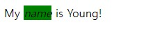
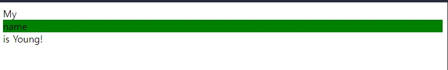

# display 정리
HTML 요소의 레이아웃을 결정하는 가장 중요한 속성 중 하나는 display이다.   

## **display 종류**   
모든 요소는 딱 한 개의 display 값을 갖고 있다.   
가질 수 있는 display의 종류는
1. inline
2. block
3. inline-block
4. flex
5. list-item
6. none   
등 여러 가지가 있다. 대부분의 요소들은 **inline과 block** 중 한 가지이다.   

## ***inline display***
inline 요소들은 다른 요소들과 같은 줄에 머무르려고 하는 성향과, 필요한 만큼의 가로 길이만 차지하는 성향이 있다.  

다음 요소들은 기본 display 값이 inline이다.   

1. ```<span>```
2. ```<a>```
3. ```<b>```
4. ```<i>```
5. ``````
6. ```<button>```   

* html
```html
My <i>name</i> is Young!
```
* css
```css
i {
  background-color: green;
}
```
  

```<i>``` 태그는 기본적으로 inline이기 때문에 앞, 뒤의 텍스트와 같은 줄에 머무르고 있고, 가로 길이는 필요한 만큼만 차지하고 있다.

## ***block display***
block 요소들은 다른 요소들과 독단적인 줄에 가려고 하는 성향과, 최대한 많은 가로 길이를 차지하는 성향이 있다.

다음 요소들은 기본 display 값이 block이다.   
1. ```<div>```
2. ```<h1>, <h2>, <h3>, <h4>, <h5>, <h6>```
3. ```<p>```
4. ```<nav>```
5. ```<ul>```
6. ```<li>```

* html
```html
My <div>name</div> is Young!
```
* css
```css
div {
  background-color: green;
}
```



```<div>``` 태그는 기본적으로 block이기 때문에 새로운 줄에 가버린다. 그리고 가로 길이는 최대한 많이, 100%를 차지하고 있다는 것을 알 수 있다.

## ***display 바꾸기***
모든 요소는 기본적으로 정해진 display 값이 있다. CSS를 통해서 이를 바꿀 수 있다.    

### **inline 요소를 block으로 바꾸기**
* html
```html
My <i>name</i> is Young!
```
* css
```css
i {
  display: block; /* <i> 태그를 block으로 바꾸기 */
  background-color: green;
}
```


### **block 요소를 inline으로 바꾸기**
* html
```html
<div class="div1">Hello World!</div>
<div class="div2">My name is Young!</div>
```
* css
```css
div {
  display: inline; /* <div> 태그를 inline으로 바꾸기 */
}

.div1 {
  background-color: green;
}

.div2 {
  background-color: blue;
}
```

