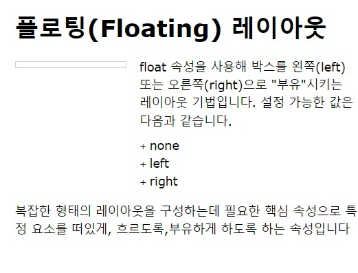

# 플로팅(Float) 레이아웃과 clear 속성
뷰포트(Viewport)와 관련하여 레이아웃(배치)을 다루기 위한 ```float, clear``` 속성에 대해 알아보자.

## ***플로팅 레이아웃(float)***
```CSS float```속성은 복잡한 형태의 레이아웃을 구성하는데 필요한 핵심 속성으로 특정 요소를 **떠있게, 흐르도록, 부유하게** 하도록 하는 속성이다.   
즉, float 속성을 사용해 박스를 왼쪽(left) 또는 오른쪽(right)으로 "부유"시키는 레이아웃 기법이다.
 >  여기서 '부유하다' 라는 의미는 요소가
    기본적인 문서 배치의 흐름에서 벗어나 요소의 모서리가 페이지의 왼쪽이나 오른쪽으로 이동하는 것을 말한다.
    
이 플로팅 모델을 이용하면 문서의 흐름과 관계없이 화면 배치를 유연하게 할 수 있는 장점이 있다.    

* html
```html
<h1>플로팅(Floating) 레이아웃</h1>


<div class="group">
<p>float 속성을 사용해 박스를 왼쪽(left) 또는 오른쪽(right)으로 "부유"시키는 레이아웃 기법입니다. 설정 가능한 값은 다음과 같습니다.</p>

<ul>
  <li>none</li>
  <li>left</li>
  <li>right</li>
</ul>


</div>
  <p>복잡한 형태의 레이아웃을 구성하는데 필요한 핵심 속성으로 특정 요소를 떠있게, 흐르도록,부유하게 하도록 하는 속성입니다</p>
```

* css
```css
html {
  font-size: 10px;
}
body {
  margin: 3rem;
  width: 400px;
  font: 1.4rem/1.5 Verdana, Arial, Sans-Serif;
}
h1, p {
  margin-top: 0;
  white-space: pre-line;
}

h1 {
  line-height: 1.2;
}

p {
  margin-bottom: 0.7rem;
}

ul {
  margin-top: 0.7rem;
  list-style: none;
  padding-left: 0;
}

li::before {
  content: '+ ';
  font-size: 10px;
}

.profile {
  position: relative;
  top: 4px;
  box-sizing: border-box;
  border: 1px solid #d0d0d0;
  padding: 3px;
  vertical-align: middle;
  width: 130px;
  height: auto;
}

.group {
overflow: hidden; 
}

.profile {
  float: left;  /* 프로필은 왼쪽으로 고정으로 정려라면서 글은 오른쪽으로 나란히 정렬할 수 있는 것을 볼 수 있다.*/
  margin-right: 15px;
}
```

결과, 


## **float css**
* css
```css
.box {
    float: value;
}
```
다음은 float의 속성값(value)이다.
* **left** : 요소를 왼쪽 방향으로 부유하게 설정
* **right** : 요소를 오른쪽 방향으로 부유하게 설정
* **none** : 기본값(default), 요소를 띄우지 않는다.
    
## **주의**
플롯 속성을 사용할 요소는 ```position``` 속성의 ```absolute``` 값과 양립할 수 없다.

## ***clear - 플로팅 해제 기법***
플로팅한 요소는 문서의 흐름상에서 벗어난 상태이기 때문에 레이아웃을 무너뜨리게 되는 현상을 보게 된다. 이는 플롯을 사용하면 발생되는 현상이며 이러한 문제를 해결하기 위해서는 float 을 해제해 주어야 한다.
    
>"float 을 해제한다" 는 의미는 float 이 적용된 요소를 해제하는 것이 아니라 clear 속성을 적용해 ```float``` 의 영향을 받지 않도록 한다는 의미를 뜻한다.
    
    
플롯을 해제하는 방법 중에 ```clearfix``` 라는 방법이 있다.   
    
```float```을 사용해 레이아웃을 잡다보면 ```clear``` 가 필요해지기 때문에 가급적 플롯된 요소의 부모 요소에 ```clearfix``` 방법을 적용하는 것을 권장하고 있다.

* css
```css
.clearfix { clear: value; }
```
clear 속성값은 다음과 같다.
    
* **left** : 왼쪽에 floating 된 요소를 지정 해제
* **right** : 오른쪽에 floating 된 요소를 지정 해제
* **both** : 왼쪽 오른쪽 모두 floating 된 요소를 지정 해제
* **none** : 기본값(default), floating 을 해제하지 않음