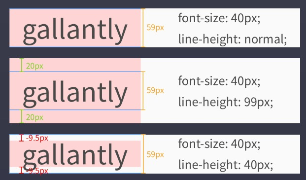
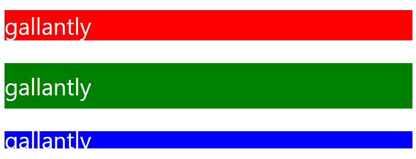

# 줄 간격
```line-height```를 사용하면 줄간격을 조절할 수 있다.    
line-height 속성을 '완벽하게' 이해하려면 타이포그래피 지식이 조금 필요하므로 아주 간단하게 설명을 하자면,    
   
위 사진에 파란 줄을 보면, 이 파란 줄 사이가 실제 내용이 들어가 있는 **``` 'content area'(콘텐츠 영역)```** 입니다.  font-family와 font-size에 따라서 'content area'가 정해지고, line-height는 'content area'에 영향을 주지 않는다.

``line-height``를 통해서는 각 줄이 실질적으로 차지하는 공간을 정해줄 수 있다. 예를 들면, 99px로 설정하면 'content area'보다 40px이 많기 때문에 위 아래로 20px의 공간이 추가로 생긴다.

반대로 40px로 설정하면 'content area'보다 19px이 적기 때문에 위 아래로 -9.5px의 공간이 줄어든다.   

## 코드 예시
* html
```html
<p class="p1">gallantly</p>
<p class="p2">gallantly</p>
<p class="p3">gallantly</p>
```
* css
```css
p {
  font-size: 40px;
  color: white;
}

.p1 {
  background-color: red;
  line-height: normal;
}

.p2 {
  background-color: green;
  line-height: 80px;
}

.p3 {
  background-color: blue;
  line-height: 30px;
}
```

코드 결과   

