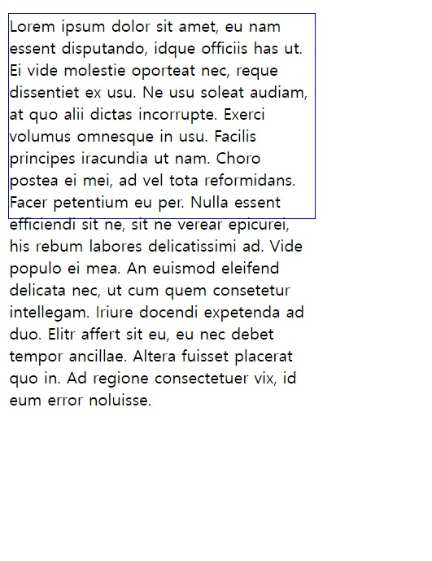
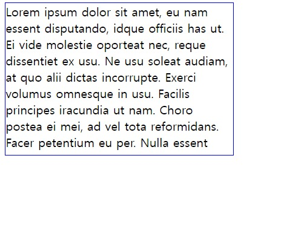
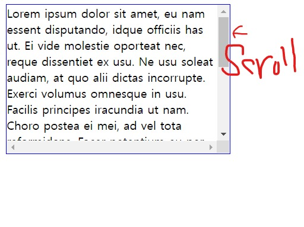

# overflow
```width, height, max-width, max-height``` 등을 설정하다 보면 내용물이 들어갈 공간이 부족한 경우가 있다.  예를 들어, 밑에 코드를 보면,
* html 
```html
<p>Lorem ipsum dolor sit amet, eu nam essent disputando, idque officiis has ut. Ei vide molestie oporteat nec, reque dissentiet ex usu. Ne usu soleat audiam, at quo alii dictas incorrupte. Exerci volumus omnesque in usu. Facilis principes iracundia ut nam. Choro postea ei mei, ad vel tota reformidans. Facer petentium eu per. Nulla essent efficiendi sit ne, sit ne verear epicurei, his rebum labores delicatissimi ad. Vide populo ei mea. An euismod eleifend delicata nec, ut cum quem consetetur intellegam. Iriure docendi expetenda ad duo. Elitr affert sit eu, eu nec debet tempor ancillae. Altera fuisset placerat quo in. Ad regione consectetuer vix, id eum error noluisse.</p>
```
*  css
``` css
p {
  border: 1px solid blue;
  width: 300px;
  height: 200px;
}
```

이 결과로는, 밑 이미지 처럼 나온다.
   

이렇게 넘쳐나는 내용물을 overflow 속성으로 처리해줄 수 있다.   
   

# **옵션1 : visible**  
visible 값을 사용하면 넘쳐나는 내용물이 그대로 보인다. 따로 설정해주지 않아도 이게 기본값이므로 그대로 보인다. 예를 들어, 위에 css코드에 ```visible```을 써도 똑같은 결과가 나온다. 즉, 굳이 쓸 필요는 없다.
* css
```css
p {
  border: 1px solid blue;
  width: 300px;
  height: 200px;
  overflow: visible; /*굳이 쓸 필요 없음 */
}
```    

# **옵션2 : hidden**
hidden 값을 사용하면 넘쳐나는 부분을 숨겨주는 역할을 한다.   
(html코드는 위에와 같다.)
* css
```css
p {
  border: 1px solid blue;
  width: 300px;
  height: 200px;
  overflow: hidden;
}
```
이 결과로는, 박스칸 넘친 내용이 없어진 걸 확인 할 수 있다.
   

# **옵션 3: scroll**
내용물을 숨겼다가, 사용자가 스크롤을 하면 볼 수 있게 해주는 역할을 한다.   
(html코드는 위에와 같다.)    
* css
```css
p {
  border: 1px solid blue;
  width: 300px;
  height: 200px;
  overflow: scroll;
}
```
결과, 스크롤이 생긴 것을 확인 할 수 있다.


# **옵션 4: auto**
scroll과 거의 똑같지만, 한 가지 차이점이 있다. scroll은 항상 스크롤바를 보여주고, ***auto는 내용물이 넘쳐날 때만 스크롤바를 보여준다.***   
 

*참고로 Mac OS에서는 스크롤을 할 때만 스크롤바를 보여주는 경향이 있기 때문에 scroll과 auto의 차이를 보기 힘들 수도 있습니다.*
(마찬가지로 html코드는 위에 와 같다.)
* css
```css
p {
  border: 1px solid blue;
  width: 300px;
  height: 200px;
  overflow: auto;
}
```
결과는 scroll 결과와 같다. 
