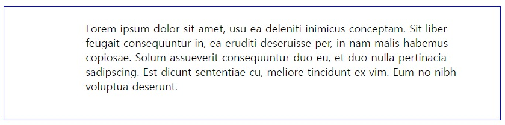
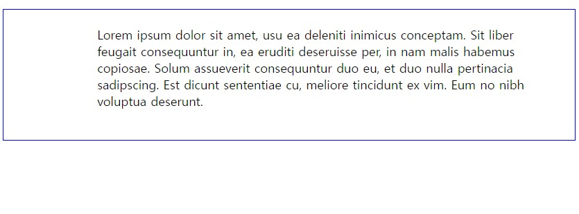
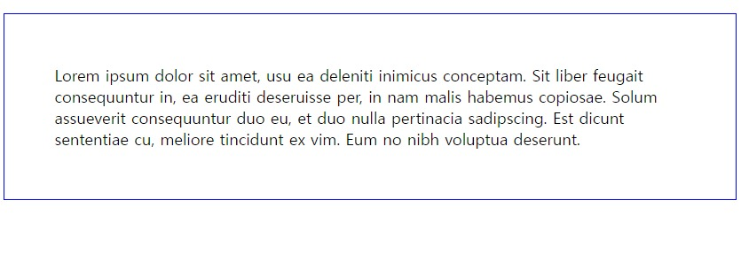
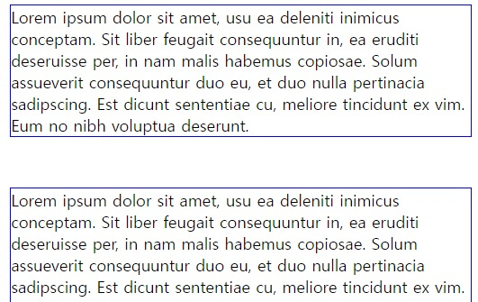
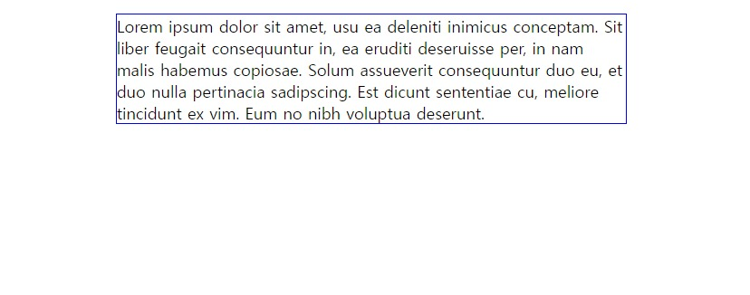

# Padding과 Margin의 차이
요소는 ```내용(content), 패딩(padding), 테두리(border)```로 이루어져 있다.   
**Padding**은 내용과 테두리 사이의 '여유 공간'을 말한다. 반면에,  **Margin**은 요소 주위의 여백을 말한다. 즉, 테두리 밖의 공간인 것이다.    
그림을 참고하여 보자.   
   

# Padding
Padding을 주는 방법에는 몇 가지가 있다.

## **가장 직관적인 방법**   
* html
```html
<p>Lorem ipsum dolor sit amet, usu ea deleniti inimicus conceptam. Sit liber feugait consequuntur in, ea eruditi deseruisse per, in nam malis habemus copiosae. Solum assueverit consequuntur duo eu, et duo nulla pertinacia sadipscing. Est dicunt sententiae cu, meliore tincidunt ex vim. Eum no nibh voluptua deserunt.</p>
```
* css
```css
p {
  border: 1px solid blue;
  padding-top: 20px;
  padding-bottom: 40px;
  padding-left: 120px;
  padding-right: 60px;
}
```   
결과는, 이렇게 나온다.  
   


한 줄에 쓰고 싶으면 padding 속성을 쓰면 된다. 순서는 위(padding-top)부터 시계 방향으로 하나씩 쓰면 된다. 즉,   
* css
```css
p {
  padding: 위 오른쪽 아래 왼쪽;
}
``` 
예를 들어, 위의 코드와 똑같이 쓰기 위해서는 이렇게 하면 된다. (css코드보기)
* html
``` html
<p>Lorem ipsum dolor sit amet, usu ea deleniti inimicus conceptam. Sit liber feugait consequuntur in, ea eruditi deseruisse per, in nam malis habemus copiosae. Solum assueverit consequuntur duo eu, et duo nulla pertinacia sadipscing. Est dicunt sententiae cu, meliore tincidunt ex vim. Eum no nibh voluptua deserunt.</p>
```
*  css
```css
p {
  border: 1px solid blue;
  padding: 20px 60px 40px 120px;
}
```
결과는, 
   

## **위, 아래, 왼쪽, 오른쪽이 다 같은 경우**  
만약 위, 아래, 왼쪽, 오른쪽에 똑같은 padding을 주고 싶으면, 모두 50px의 padding을 주려면 이렇게 하면 된다. (css 코드 참고) 
* html
```html
<p>Lorem ipsum dolor sit amet, usu ea deleniti inimicus conceptam. Sit liber feugait consequuntur in, ea eruditi deseruisse per, in nam malis habemus copiosae. Solum assueverit consequuntur duo eu, et duo nulla pertinacia sadipscing. Est dicunt sententiae cu, meliore tincidunt ex vim. Eum no nibh voluptua deserunt.</p>
```
* css
```css
p {
  border: 1px solid blue;
  padding: 50px;
}
```
결과는,   


## **위, 아래가 같고, 왼쪽, 오른쪽이 같은 경우**
위, 아래에 50px의 padding을 주고, 왼쪽, 오른쪽에 100px의 padding을 주려면 밑에 처럼 하면 된다.
* css
```css
p {
  border: 1px solid blue;
  padding: 50px 100px;
}
```

# Margin
요소에게 margin을 주는 방법은 padding을 주는 방법과 똑같다.  

## **가장 직관적인 방법**
* html
```html
<p>Lorem ipsum dolor sit amet, usu ea deleniti inimicus conceptam. Sit liber feugait consequuntur in, ea eruditi deseruisse per, in nam malis habemus copiosae. Solum assueverit consequuntur duo eu, et duo nulla pertinacia sadipscing. Est dicunt sententiae cu, meliore tincidunt ex vim. Eum no nibh voluptua deserunt.</p>
<p>Lorem ipsum dolor sit amet, usu ea deleniti inimicus conceptam. Sit liber feugait consequuntur in, ea eruditi deseruisse per, in nam malis habemus copiosae. Solum assueverit consequuntur duo eu, et duo nulla pertinacia sadipscing. Est dicunt sententiae cu, meliore tincidunt ex vim. Eum no nibh voluptua deserunt.</p>
```
* css
```css
p {
  border: 1px solid blue;
  margin-top: 50px;
  margin-bottom: 40px;
  margin-left: 200px;
  margin-right: 60px;
}
```   
결과는,   


## **한줄로**
```css
p {
  margin: 위 오른쪽 아래 왼쪽;
}
```
즉, 위와 똑같이 코드를 쓰면,   
```css
p {
  margin: 50px 60px 40px 200px;
}
```
## **위, 아래, 왼쪽, 오른쪽이 다 같은 경우**
```css
p {
  margin: 50px;
}
```

## **위, 아래가 같고, 왼쪽, 오른쪽이 같은 경우**
```css
p {
  margin: 50px 70px;
}
```

## **가운데 정렬**   
요소를 가운데 정렬하고 싶으면 왼쪽과 오른쪽 margin 값을 auto로 설정해줘야 한다.    
``auto``는 말 그대로 '자동으로 계산'하라는 뜻이다. 왼쪽과 오른쪽을 auto로 설정하면 자동으로 왼쪽과 오른쪽을 똑같이 함으로써 요소는 가운데 정렬이 된다.   
* html
```html
<p>Lorem ipsum dolor sit amet, usu ea deleniti inimicus conceptam. Sit liber feugait consequuntur in, ea eruditi deseruisse per, in nam malis habemus copiosae. Solum assueverit consequuntur duo eu, et duo nulla pertinacia sadipscing. Est dicunt sententiae cu, meliore tincidunt ex vim. Eum no nibh voluptua deserunt.</p>
```
* css
```css
p {
  border: 1px solid blue;
  width: 500px;
  margin-left: auto;
  margin-right: auto;
}
```
결과는, 사진과 같이 된다.
