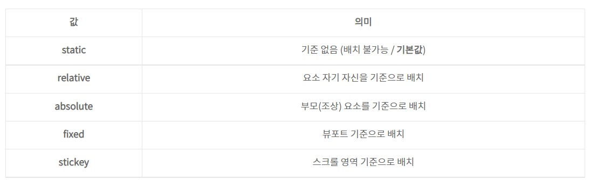

# position
* ```position``` 속성을 통해 **문서 상에 요소를 배치하는 방법**을 지정하는 것이다.   
* ```top, right, bottom, left``` 속성을 통해 **요소의 최종 위치**를 결정한다.


## position 속성
   

## Top, Bottom, Left, Right 속성
기준점을 잡았으면 다음 네 가지 속성을 이용해서 요소의 위치를 옮길 수 있다.

요소의 Position 기준에 맞춰 위쪽, 아래쪽, 왼쪽, 오른쪽에서의 거리를 설정한다.   

* ```top``` : 요소의 position 기준에 맞는 위쪽에서의 거리(위치)를 설정
* ```bottom``` : 요소의 position 기준에 맞는 아래쪽에서의 거리(위치)를 설정
* ```left``` : 요소의 position 기준에 맞는 왼쪽에서의 거리(위치)를 설정
* ```right``` : 요소의 position 기준에 맞는 오른쪽에서의 거리(위치)를 설정

## ***Relative 포지션***
요소를 일반적인 문서 흐름에 따라 배치한다.

요소 자기 자신의 원래 위치(static일 때의 위치)를 기준으로 배치한다.   
즉, 원래 위치가 기준을 뜻한다.

* **원래 위치를 기준**으로 위쪽(top), 아래쪽(bottom), 왼쪽(left), 오른쪽(right)에서 얼마만큼 떨어질 지 결정한다.
* 위치를 이동하면서 다른 요소에 영향을 주지 않는다.
* 문서 상 원래 위치가 그대로 유지된다.   


##  ***Absolute 포지션***
요소를 일반적인 문서 흐름에서 제거한다.

**가장 가까운 위치에 있는 조상 요소를 기준**으로 배치한다.

* 조상 요소 위치를 기준으로 위쪽(top), 아래쪽(bottom), 왼쪽(left), 오른쪽(right)에서 얼마만큼 떨어질 지 결정한다.
* 조상 중 Position을 가진 요소가 없다면 초기 컨테이닝 블록(<body>요소)를 기준으로 삼는다. (static을 제외한 값)
* 문서 상 원래 위치를 잃어버린다. (아래에 있는 div가 해당 자리를 차지한다)  

## ***Fixed 포지션***
뷰포트를 기준으로 삼고 싶은 경우?

absolute를 사용해서 똑같이 구현할 수 있지만, absolute는 조상 요소의 위치를 기준점으로 삼는 개념이므로, 뷰포트를 기준으점으로 삼으려면 fixed를 사용한다.
즉, 브라우저 윈도우가 기준이 된다.

* 요소를 일반적인 문서 흐름에서 제거한다.
* 페이지 레이아웃에 어떠한 공간도 배정하지 않는다.
* 뷰포트를 기준점으로 붙어있다 (== 화면에 붙어있다.)

주로 스크롤 내릴 때 그대로 유지하는 역할을 한다.
