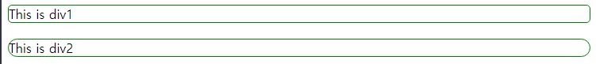
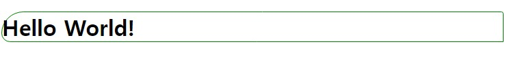
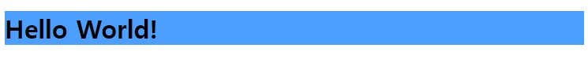
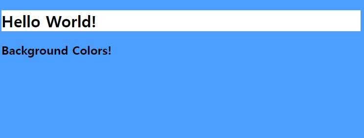
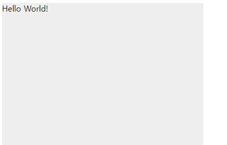
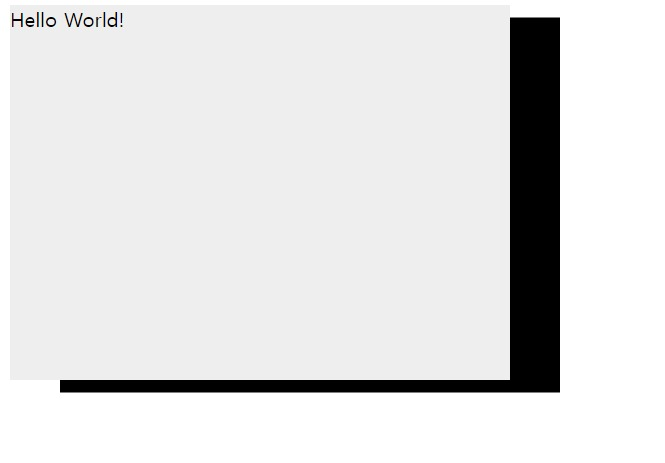
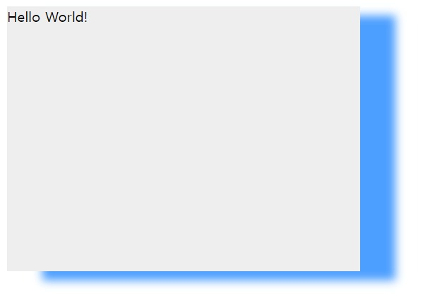
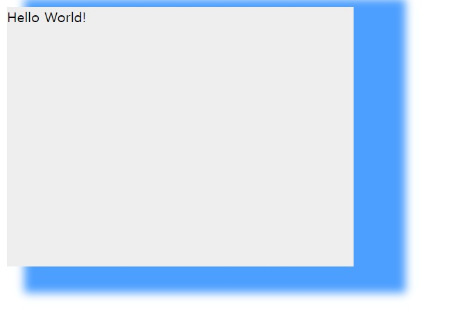

# 박스 꾸미기
## **1. 둥근 모서리**
```border-radius```속성을 사용하면 요소의 모서리를 **둥글게** 만들 수 있다. 큰 값을 쓰면 더 둥글게 된다.   
* html
```html
<div class="div1">
  This is div1
</div>

<div class="div2">
  This is div2
</div>
```
* css
```css
.div1 {
  border: 1px solid green;
  border-radius: 5px;
  margin-bottom: 20px;
}

.div2 {
  border: 1px solid green;
  border-radius: 30px;
}
```
   

만약, 네 면이 둥글게 하고 싶지 않으면, 개별설정을 하면 된다. 
* html
```html
<h1>Hello World!</h1>
```
* css
```css
h1 {
  border: 1px solid green;
  border-top-left-radius: 50px; /* 왼쪽 위 */
  border-top-right-radius: 5px; /* 오른쪽 위 */
  border-bottom-right-radius: 0px; /* 오른쪽 아래 */
  border-bottom-left-radius: 20px; /* 왼쪽 아래 */
}
```


## **2. 배경색**
```background-color``` 속성을 사용하면 배경색을 설정할 수 있다. 폰트 색을 설정할 때처럼 색 이름, RGB 코드, HEX 코드 중 하나를 입력하면 된다.  
* html
```html
<h1>Hello World!</h1>
```
* css
```css
h1 {
  background-color: #4d9fff;
}
```


## **2-1 페이지 배경색**
페이지 전체의 배경색을 설정하고 싶으면 ```body``` 태그에 ```background-color``` 속성을 입혀주면 된다. 

그리고 배경색을 투명하게 두고 싶으면 ```transparent``` 값으로 설정해주면 되는데, 따로 설정을 해주지 않으면 ```transparent```가 기본값으로 설정된다.

* html
```html
<h1>Hello World!</h1>
<h2>Background Colors!</h2>
```
* css
```css
body {
  background-color: #4d9fff;
}

h1 {
  background-color: white;
}

h2 {
  background-color: transparent /*기본값*/
}
```
   

## **3. 그림자**
요소에 그림자를 주기 위해서는 ```box-shadow``` 속성을 사용하면 된다. 기본값은 none이다. 즉, 그림자가 없다는 뜻이다.   
* html
```html
<div class="div1">
  Hello World!
</div>
```
* css
```css
.div1 {
  background-color: #eeeeee;
  width: 400px;
  height: 300px;
  box-shadow: none; /*기본값*/
}
```


## **3-1 그림자 추가**
### **위치 설정**
그림자의 위치만 설정해주면 그림자가 나타난다. 가로 위치와 세로 위치를 설정해 주자.   
* html
```html
<div class="div1">
  Hello World!
</div>
```
* css
```css
.div1 {
  background-color: #eeeeee;
  width: 400px;
  height: 300px;
  box-shadow: 40px 10px;
}
```


### **그림자 색 설정***
위의 이미지를 보면 그림자가 검정색이다. 따로 설정해주지 않으면 그림자는 검정색이다. 만약 다른 색으로 바꾸고 싶으면 box-shadow속성에 추가로 색을 써주면 된다.
* css
```css
.div1 {
  background-color: #eeeeee;
  width: 400px;
  height: 300px;
  box-shadow: 40px 10px #4d9fff; /*색추가*/
}
```
### 흐림 정도 (blur)
```box-shadow``` 속성에서 그림자가 얼마나 **흐리게** 나올지 설정할 수 있다. 가로, 세로 위치 뒤에 추가해주면 된다. 기본값은 0px이다.   
* html
```html
<div class="div1">
  Hello World!
</div>
```
* css
```css
.div1 {
  background-color: #eeeeee;
  width: 400px;
  height: 300px;
  box-shadow: 40px 10px 10px #4d9fff;
}
```


### **그림자 크기 (spread)**
그림자가 얼마나 퍼질지도 설정할 수 있다. 흐림 값 이후에 써주면 된다.
(html코드는 위에와 같다.)
* css
```css
.div1 {
  background-color: #eeeeee;
  width: 400px;
  height: 300px;
  box-shadow: 40px 10px 10px 20px #4d9fff;
}
```
