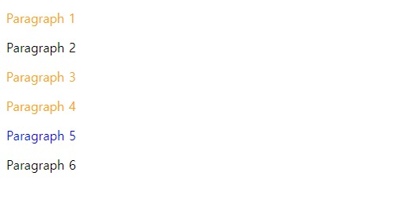
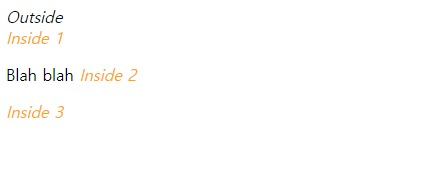
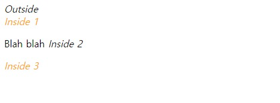
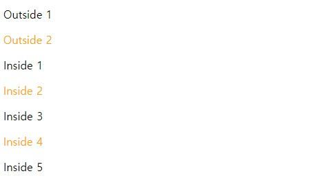
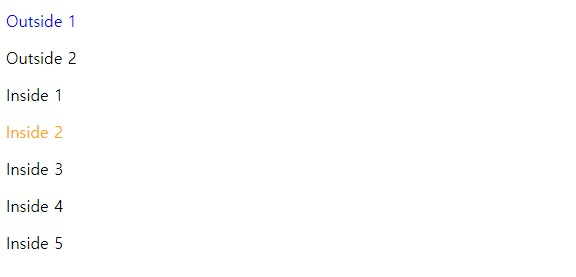
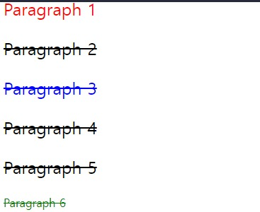

# 선택자 정리
'선택자'는 css에서 스타일링 해줄 요소를 결정하는 것을 말한다.

## **태그 이름**
* html
```html
<h1>Heading 1</h1>
<h2>Heading 2</h2>
```
* css
```css
/* 모든 <h1> 태그 */
h1 {
  color: orange;
}
```


## **클래스/아이디**
* html
```html
<p class="important">Paragraph 1</p>
<p>Paragraph 2</p>
<p class="important">Paragraph 3</p>
<p class="important">Paragraph 4</p>
<p id="favorite">Paragraph 5</p>
<p>Paragraph 6</p>
```
* css
```css
/* 'important'라는 클래스를 갖고 있는 모든 태그 */ /*.*/
.important {
  color: orange;
}

/* 'favorite'라는 아이디를 갖고 있는 태그 */ /*#*/
#favorite {
  color: blue;
}
```



## **자식 (children)**
* html
```html
<i>Outside</i>
<div class="div1">
  <i>Inside 1</i>
  <p>Blah blah <i>Inside 2</i></p>
  <i>Inside 3</i>
</div>
```
* css
```css
/* 'div1' 클래스를 갖고 있는 요소의 자식 중 모든 <i> 태그 */
.div1 i {
  color: orange;
}
```


## **직속 자식 (direct children)**
* html
```html
<i>Outside</i>
<div class="div1">
  <i>Inside 1</i>
  <p>Blah blah <i>Inside 2</i></p>
  <i>Inside 3</i>
</div>
```
* css
```css
/* 'div1' 클래스를 갖고 있는 요소의 직속 자식 중 모든 <i> 태그 */
.div1 > i {
  color: orange;
}
```


## **복수 선택**
* html
```html
<p class="one">Outside 1</p>
<p class="two">Outside 2</p>
<div>
  <p class="one">Inside 1</p>
  <p class="two">Inside 2</p>
  <p class="three">Inside 3</p>
  <p class="four">Inside 4</p>
  <p class="five">Inside 5</p>
</div>
```
* css
```css
/* 'two' 클래스를 가지고 있는 태그 모두와 'four' 클래스를 가지고 있는 태그 모두 선택 */
.two, .four {
  color: orange;
}
```


## **여러 조건**
* html
```html
<p class="outside one">Outside 1</p>
<p class="outside two">Outside 2</p>
<div>
  <p class="inside one">Inside 1</p>
  <p class="inside two">Inside 2</p>
  <p class="inside three">Inside 3</p>
  <p class="inside four">Inside 4</p>
  <p class="inside five">Inside 5</p>
</div>
```
* css
```css
/* 'outside' 클래스를 갖고 있으면서 'one' 클래스도 갖고 있는 태그 */
.outside.one {
  color: blue;
}

/* 'inside' 클래스를 갖고 있으면서 'two' 클래스도 갖고 있는 태그 */
.inside.two {
  color: orange;
}
```



## **Pseudo-class (가상 클래스)**
콜론(:)을 사용하면 몇 가지 '가상 클래스'를 선택할 수 있다.

### **n번째 자식**
* html
```html
<div class="div1">
  <p>Paragraph 1</p>
  <p>Paragraph 2</p>
  <p>Paragraph 3</p>
  <p>Paragraph 4</p>
  <p>Paragraph 5</p>
  <p>Paragraph 6</p>
</div>
```
* css
```css
/* .div1의 자식인 <p> 태그 중 마지막 */
.div1 p:last-child {
  color: green;
}

/* .div1의 자식 중 마지막 자식이 아닌 <p> 태그 */
.div1 p:not(:last-child) {
  font-size: 150%;
}

/* .div1의 자식 중 첫 번째 자식이 아닌 <p> 태그 */
.div1 p:not(:first-child) {
  text-decoration: line-through;
}
```



## **마우스 오버 (hover)**
* html
```html
<h1>Hello World!</h1>
```
* css
```css
h1 {
  color: orange;
}

/* 마우스가 <h1> 태그에 올라갔을 때 */ /*주황 -> 그린 으로 바뀜*/
h1:hover {
  color: green;
}
```

