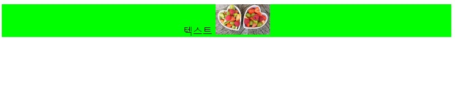
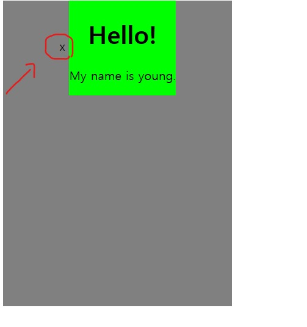
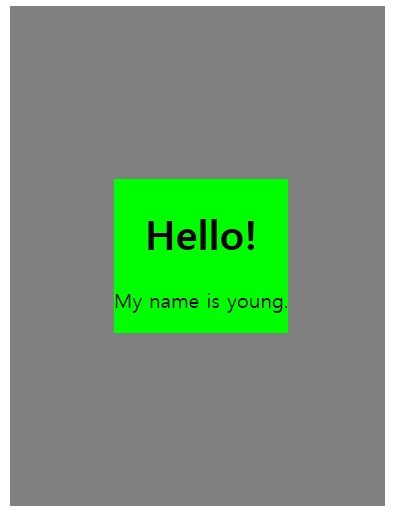
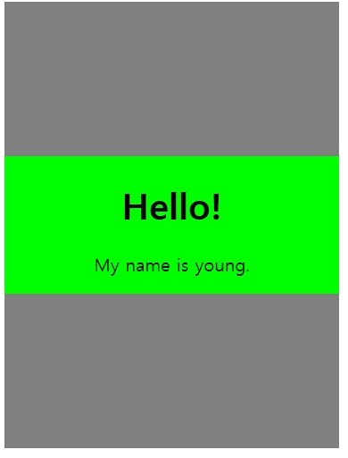

# 세로 가로 가운데 정렬 
## ***가로 가운데 정렬*** 
어떤 요소를 가로로 가운데 정렬하려면 어떻게 해야 할까? 

### ***inline 요소***
```inline``` 또는 ```inline-block``` 요소면 부모 태그에 ```text-align: center;```를 써주면 된다.
* html
```html
<div class="container">
  텍스트 
</div>
```
* css
```css
.container {
  text-align: center;
  background-color: lime;
}
```


### ***block 요소***
```block``` 요소면 ```margin-left: auto;, margin-right: auto;```를 써주면 된다.
* html
```html
<div class="block-element"></div>
```
* css
```css
.block-element {
  width: 100px;
  height: 50px;
  margin-left: auto;
  margin-right: auto;
  background-color: lime;
}
```
   

## ***세로 가운데 정렬***

그렇다면 세로로 가운데 정렬하려면 어떻게 해야 할까? CSS에서 모든 걸 한 번에 딱 가운데 정렬을 시키는 방법이 없기 때문에 여러 방법을 써야한다. 

몇 가지 방법을 보자

### ***가짜 요소 더하기***

```vertical-align: middle;```을 하면 해결이 될까? ```vertical-align``` 속성은 인라인 또는 인라인 블록 요소에 적용되기 때문에 ```.info```를 인라인 블록으로 바꾼다. 그리고 ```vertical-align: middle;```을 설정해주면?
* html
```html
<div class="container">
  <div class="info">
    <h1>Hello!</h1>
    <p>My name is young.</p>
  </div>
</div>
```
* css
```css
.container {
  width: 300px;
  height: 400px;
  background-color: gray;
  text-align: center;
}

.info {
  background-color: lime;
  display: inline-block;
  vertical-align: middle; /*이부분*/
}
```


```vertical-align: middle;```은 요소의 가운데를 부모 요소의 소문자 'x'의 가운데와 맞춘다. 확인해보면, 

* html
```html
<div class="container">
  x
  <div class="info">
    <h1>Hello!</h1>
    <p>My name is young.</p>
  </div>
</div>
```
* css
```css
.container {
  width: 300px;
  height: 400px;
  background-color: gray;
  text-align: center;
}

.info {
  background-color: lime;
  display: inline-block;
  vertical-align: middle;
}
```



```.info ```요소를 완전 가운데로 오게 하려면 우선 소문자 'x'가 가운데로 와야 한다. 방법은 하나 있다. 세로 길이가 100%인 요소를 만들고, 그 요소에도 ```vertical-align: middle;```을 하면 된다.

* html
```html
<div class="container">
  x
  <div class="helper"></div>
  <div class="info">
    <h1>Hello!</h1>
    <p>My name is young.</p>
  </div>
</div>
```
* css
```css
.container {
  width: 300px;
  height: 400px;
  background-color: gray;
  text-align: center;
}

.helper {
  display: inline-block;
  height: 100%;
  vertical-align: middle;
  
  /* 설명을 위해서 */
  width: 10px;
  background-color: red;
}

.info {
  background-color: lime;
  display: inline-block;
  vertical-align: middle;
}
```


여기서 소문자 'x'를 지우고, ```.helper``` 요소의 가로 길이를 없애면 된다.   
* html
```html
<div class="container">
  <div class="helper"></div>
  <div class="info">
    <h1>Hello!</h1>
    <p>My name is young.</p>
  </div>
</div>
```
* css
```css
.container {
  width: 300px;
  height: 400px;
  background-color: gray;
  text-align: center;
}

.helper {
  display: inline-block;
  height: 100%;
  vertical-align: middle;
}

.info {
  background-color: lime;
  display: inline-block;
  vertical-align: middle;
}
```


근데 아직도 문제가 조금 있다. ```.info```의 가로 길이가 100%라면 어떻게 되는지 보면, 

html 위의 코드와 같다.
* css
```css
.container {
  width: 300px;
  height: 400px;
  background-color: gray;
  text-align: center;
}

.helper {
  display: inline-block;
  height: 100%;
  vertical-align: middle;
}

.info {
  background-color: lime;
  display: inline-block;
  vertical-align: middle;
  width: 100%; /*이부분*/
}

```


갑자기 아래 곳에 위치되는 것을 확인 할 수 있다. 사실 ```.helper``` 와 ```.info``` 요소 사이에 띄어쓰기가 한 칸 있어서, 가로 길이 100%인 ```.info``` 요소는 자리 부족으로 다음 줄로 가버리는 것이다.

그러면, 이 문제를 해결하기 위해서는 두 가지 방법이 있다.

### **우선 띄어쓰기를 없애는 방법:**

* html
```html
<div class="container">
  <!-- 스페이스 없애기 -->
  <div class="helper"></div><div class="info">
    <h1>Hello!</h1>
    <p>My name is young.</p>
  </div>
</div>
```
css는 위의 코드와 같다.



### **띄어쓰기 공간 만큼의 마이너스 여백을 주는 방법:**

* html
```html
<div class="container">
  <div class="helper"></div>
  <div class="info">
    <h1>Hello!</h1>
    <p>My name is young.</p>
  </div>
</div>
```
* css
```css
.container {
  width: 300px;
  height: 400px;
  background-color: gray;
  text-align: center;
}

.helper {
  display: inline-block;
  height: 100%;
  vertical-align: middle;
}

.info {
  background-color: lime;
  display: inline-block;
  vertical-align: middle;
  width: 100%;

  /* 이 경우 띄어쓰기는 5~7px 정도였습니다! */
  margin-left: -7px;
}

```


주의 사항:

어떤 요소에 ```height: 100%;```를 설정하기 위해서는 부모의 height가 설정되어 있어야 한다. 위 경우에는 ```.helper```의 부모인 ```.container```에 height가 설정되어 있었기 때문에 가능하다.   

### **line-height로 해결**
```.info```를 인라인 블록으로 설정해주면, ```line-height``` 속성을 활용해볼 수도 있다. 부모인 ```.container```에 height와 동일한 line-height를 줘보자.

```line-height``` 속성은 자식들에게 상속되기 때문에 ```.info```에는 ```line-height: normal;```을 꼭 써주셔야 한다.
* html
```html
<!DOCTYPE html>
<div class="container">
  x
  <div class="info">
    <h1>Hello!</h1>
    <p>My name is young.</p>
  </div>
</div>
```
* css
```css
.container {
  width: 300px;
  height: 400px;
  background-color: gray;
  text-align: center;
  line-height: 400px;
}

.info {
  background-color: lime;
  display: inline-block;
  line-height: normal;
  vertical-align: middle;
}
```
  

***다른 방식?***

위의 방법들 말고도 세로 가운데 정렬을 하는 다양한 방식들이 있다. 포지셔닝을 이용할 수도 있고, 최근에 나온 ```flexbox```를 이용할 수도 있다. 

