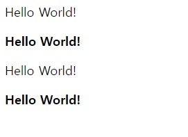
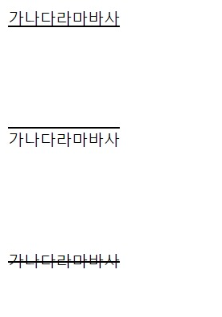

# 폰트 굵기 설정
폰트 굵기를 설정하기 위해서는 ```font-weight``` 속성을 사용해야 한다.

## 사용법
사용 가능한 값은 얇은 순서 기준으로 ```100, 200, 300, 400, 500, 600, 700, 800, 900```이다.  
즉, ```100```이 가장 얇고, ```900```이 가장 굵다는 뜻이다.   
여기서 **주의 사항**은 ```110 240 480```와 같은 값은 사용할 수 없다.   
**100단위**로 ```100부터 900까지``` 쓸 수 있다.   
(만약 사용한다면, 기본값으로 설정되므로 주의해야한다.)   
또 주의할 점은 폰트나 브라우저에 따라서 지원하는 폰트 굵기 값이 다르다. 어떤 폰트는 ```100, 400, 700```만 지원될 수 있다.   

* html
```html
<p id="p1">Hello World!</p>
<p id="p2">Hello World!</p>
<p id="p3">Hello World!</p>
<p id="p4">Hello World!</p>
```

* css
```css
#p1 {
  font-weight: 400;
}

#p2 {
  font-weight: 700;
}

#p3 {
  font-weight: normal;
}

#p4 {
  font-weight: bold;
}
```

이 코드의 결과는    
   
이렇게 나온다.   
참고로 ```font-weight: normal;```은 ```font-weight: 400;```과 똑같고, ```font-weight: bold;```는 ```font-weight: 700;```과 똑같다.   

# 폰트 밑줄 설정
```css
text-decoration : underline; /* 1번*/
text-decoration : overline; /* 2번 */
text-decoration : line-through; /*3번 */
```
각각의 css를 해주면 차례대로 밑 사진처럼 나온다.    
   

## 참고
```html
<a href="https://google.com">구글로 가는 링크</a>
``` 
이 코딩을 해주면,    
   

위 사진처럼 밑줄이 생긴다.    
이 밑줄을 없애 주려면 어떻게 해야할까?   
바로 css에 
```css
a {
  text-decoration : none;
}
```
을 써주면    
   
이렇게 밑줄이 안생긴다.