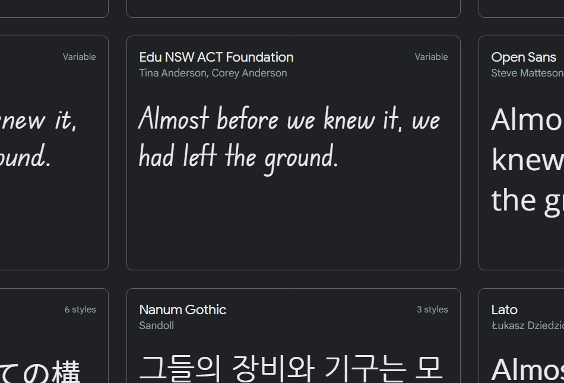
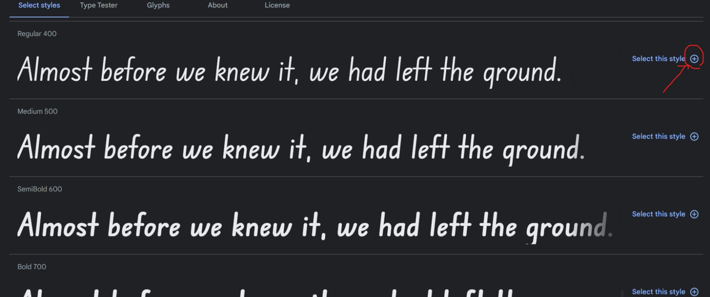
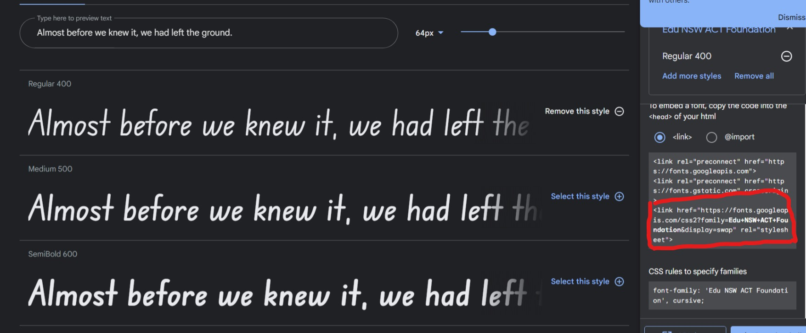
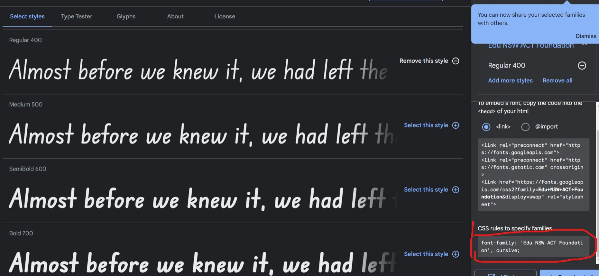
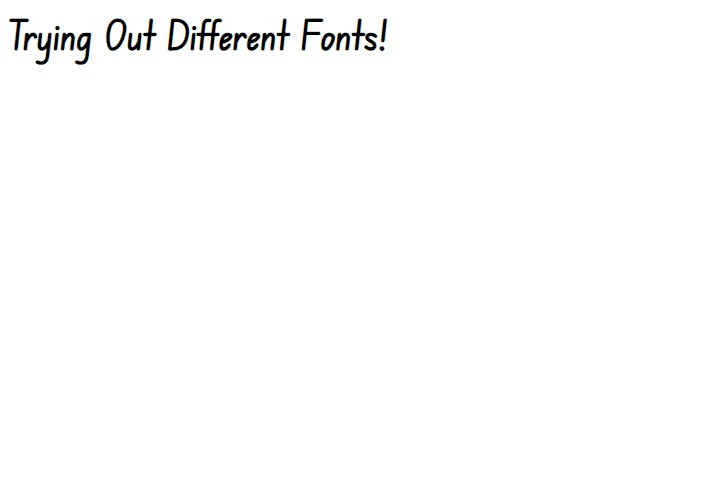
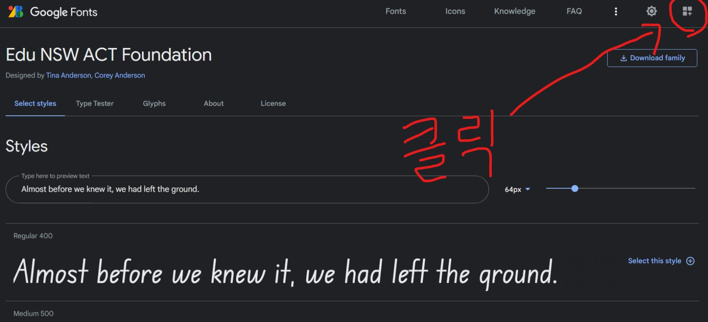

# 폰트 설정
css에 ```font-family```를 사용하여 폰트를 설정 할 수 있다.   

## 폰트 설치 되어 있을 경우
폰트 설치 되어 있을 경우 css파일에 밑 코드처럼 쓰면 된다.
```css
font-family: '폰트이름' ;
```

## 폰트 설치 안되어 있을 경우
1. 사이트: https://fonts.google.com 에 들어가서 원하는 폰트를 찾는다.   
   

2. 원하는 폰트를 찾았으면 클릭한다.   
폰트 오른쪽을 보면 ```+```버튼을 누른다.
   

3. 버튼을 누르면 link가 있다. 그 부분을 복사한다.    
   

4. 복사를 했다면, html코드에 붙여넣기 해준다.
```html
<!DOCTYPE html>

<html>
    <head>
        <title>
            Trying Out Different Fonts
        </title>
        <meta charset="utf-8">
        <!-- 이 부분 -->
        <link href="https://fonts.googleapis.com/css2?family=Edu+NSW+ACT+Foundation&display=swap" rel="stylesheet">

        <style>
            
        </style>
    </head>

    <body>
        <h1>Trying Out Different Fonts!</h1>
    </body>
</html>
```

5. 그리고 다시 사이트 들어가서 아까 링크를 복사 했던 밑에 부분(CSS)을 복사해준다.   
   

6. css코드나 html style태그에 붙여넣기 한다. 
```html
<!DOCTYPE html>

<html>
    <head>
        <title>
            Trying Out Different Fonts
        </title>
        <meta charset="utf-8">

        <link href="https://fonts.googleapis.com/css2?family=Edu+NSW+ACT+Foundation&display=swap" rel="stylesheet">

        <style>
            /* 이 부분 */
            h1 {
                font-family: 'Edu NSW ACT Foundation', cursive;
            }
        </style>
    </head>

    <body>
        <h1>Trying Out Different Fonts!</h1>
    </body>
</html>
```
여기서 참고할 점은, ```cursive```가 무엇이냐면, 만약 앞에 있는 ```'Edu NSW ACT Foundation'```가 실행이 안되면 뒤에 있는 ```cursive```폰트를 찾아서 써주면 된다는 것이다.

8. 그러면 원하는 폰트로 바꿔지는 것을 알 수 있다.   
 


만약, 플러스버튼 눌렀는데 아무것도 안뜬다면, 
   
저 버튼을 눌러주면 원하는 것이 나타난다.